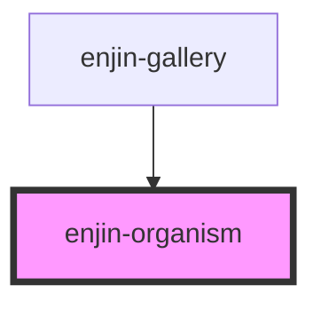

# enjin-organism

<!-- Auto Generated Below -->

## Properties

| Property      | Attribute     | Description                             | Type                                       | Default     |
| ------------- | ------------- | --------------------------------------- | ------------------------------------------ | ----------- |
| `description` | `description` | A description of what the organism does | `string`                                   | `undefined` |
| `name`        | `name`        | The name of the organism                | `string`                                   | `undefined` |
| `propList`    | --            | A list of props with descriptions       | `{ name: string; description: string; }[]` | `[]`        |

## Methods

### `viewLess() => Promise<void>`

Shrink organism to only show name and description

#### Returns

Type: `Promise<void>`

### `viewMore(options?: { scrollIntoView: boolean; }) => Promise<void>`

Expand organism to show preview frame and props info

#### Returns

Type: `Promise<void>`

## Dependencies

### Used by

 - [enjin-gallery](../gallery)

### Graph

----------------------------------------------

*Built with [StencilJS](https://stenciljs.com/)*
