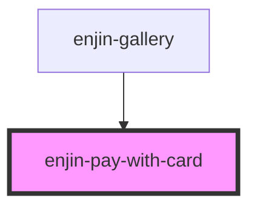

# enjin-pay-with-card

<!-- Auto Generated Below -->

## Properties

| Property    | Attribute    | Description | Type     | Default     |
| ----------- | ------------ | ----------- | -------- | ----------- |
| `stripeKey` | `stripe-key` |             | `string` | `undefined` |

## Events

| Event             | Description | Type               |
| ----------------- | ----------- | ------------------ |
| `enjinCardSubmit` |             | `CustomEvent<any>` |

## Dependencies

### Used by

 - [enjin-gallery](../gallery)

### Graph

----------------------------------------------

*Built with [StencilJS](https://stenciljs.com/)*
