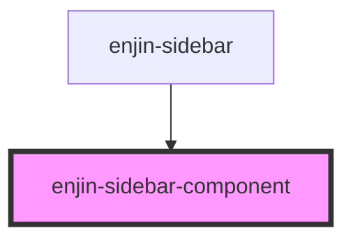

# enjin-sidebar-component

<!-- Auto Generated Below -->

## Properties

| Property    | Attribute | Description | Type                                                                                                                                                                                                                                                                                                                                                                | Default     |
| ----------- | --------- | ----------- | ------------------------------------------------------------------------------------------------------------------------------------------------------------------------------------------------------------------------------------------------------------------------------------------------------------------------------------------------------------------- | ----------- |
| `component` | --        |             | `{ docs: string; docsTags: any[]; encapsulation: string; events: any[]; methods: any[]; presets: any; props: { attr: string; default: any; docs: string; docsTags: any[]; mutable: boolean; name: string; optional: boolean; reflectToAttr: boolean; required: boolean; type: string; }[]; readme: string; slots: any[]; styles: any[]; tag: string; usage: any; }` | `undefined` |

## Events

| Event            | Description | Type               |
| ---------------- | ----------- | ------------------ |
| `enjinSetPreset` |             | `CustomEvent<any>` |

## Dependencies

### Used by

 - [enjin-sidebar](..\sidebar)

### Graph

----------------------------------------------

*Built with [StencilJS](https://stenciljs.com/)*
