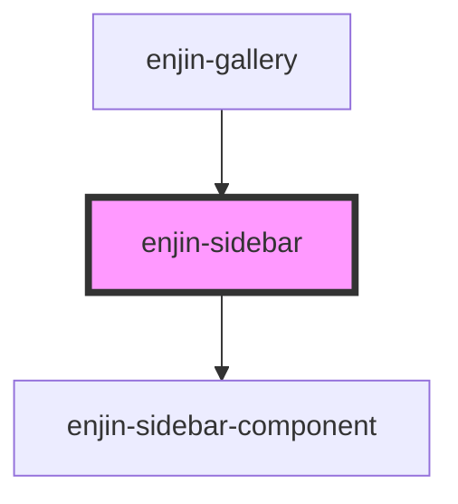

# enjin-sidebar

<!-- Auto Generated Below -->

## Properties

| Property     | Attribute    | Description | Type  | Default |
| ------------ | ------------ | ----------- | ----- | ------- |
| `components` | `components` |             | `any` | `[]`    |

## Dependencies

### Used by

 - [enjin-gallery](..\gallery)

### Depends on

- [enjin-sidebar-component](..\sidebar-component)

### Graph

----------------------------------------------

*Built with [StencilJS](https://stenciljs.com/)*
