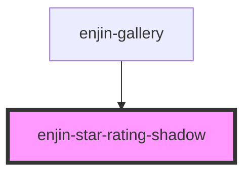

# enjin-star-rating-shadow

<!-- Auto Generated Below -->

## Properties

| Property    | Attribute    | Description | Type      | Default           |
| ----------- | ------------ | ----------- | --------- | ----------------- |
| `disabled`  | `disabled`   |             | `boolean` | `false`           |
| `maxRating` | `max-rating` |             | `number`  | `5`               |
| `name`      | `name`       |             | `string`  | `"rating-shadow"` |
| `value`     | `value`      |             | `string`  | `undefined`       |

## Events

| Event          | Description | Type               |
| -------------- | ----------- | ------------------ |
| `ftStarRating` |             | `CustomEvent<any>` |

## Methods

### `setCurrentRating(rating: any) => Promise<void>`

#### Returns

Type: `Promise<void>`

## Dependencies

### Used by

 - [enjin-gallery](../gallery)

### Graph

----------------------------------------------

*Built with [StencilJS](https://stenciljs.com/)*
