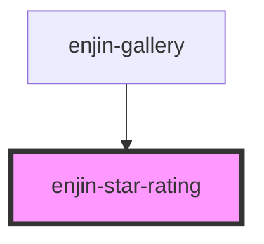

# enjin-star-rating

<!-- Auto Generated Below -->

## Properties

| Property    | Attribute    | Description                          | Type      | Default     |
| ----------- | ------------ | ------------------------------------ | --------- | ----------- |
| `disabled`  | `disabled`   | Whether or not the field is disabled | `boolean` | `false`     |
| `maxRating` | `max-rating` | The max available star rating        | `number`  | `5`         |
| `name`      | `name`       | The name of the input                | `string`  | `"rating"`  |
| `value`     | `value`      | The value of the rating input        | `string`  | `undefined` |

## Events

| Event             | Description | Type               |
| ----------------- | ----------- | ------------------ |
| `enjinStarRating` |             | `CustomEvent<any>` |

## Methods

### `setCurrentRating(rating: any) => Promise<void>`

Set the current rating

#### Returns

Type: `Promise<void>`

## Dependencies

### Used by

 - [enjin-gallery](../gallery)

### Graph

----------------------------------------------

*Built with [StencilJS](https://stenciljs.com/)*
